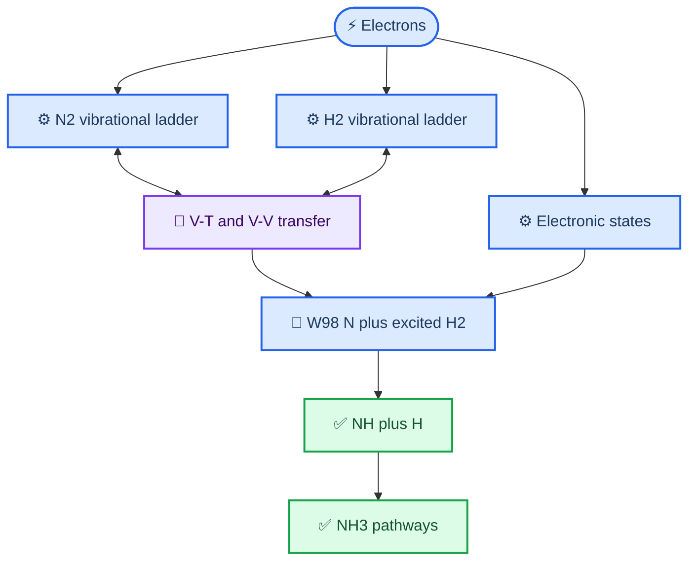
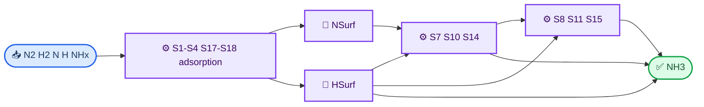

# Hong 2017/2018 校正动力学反应清单与网络图
_基于 `kinet_hong_2017_2018_corrected.inp` 自动生成；覆盖 2017 论文与 2018 勘误。生成日期：2026-08-25。_
---
## 📋 阅读说明
本文档逐行记录主输入文件中 `457` 条显式反应表达式。`@M` 表示第三体占位符，预处理器会按相邻的 `@M = ...` 清单展开；因此预处理器最终读取的是 **504 条反应记录**。包含 `$` 的行是速率表达式所需的 Fortran 变量或方程定义，不另算作化学反应。
速率列保留输入文件的原始表达式或 BOLSIG+ 标签；指数中 `Tgas` 单位为 K，`Te/11600` 为 eV，二体/三体速率系数单位分别为 cm³ s⁻¹ / cm⁶ s⁻¹。表面段使用金属列，`Surf` 为空位，`NSurf`、`HSurf`、`NHSurf`、`NH2Surf` 是吸附态。
> ⚠️ **范围说明：** 文献未公布作者原始代码、完整 BOLSIG+ 截面修订版和式 (38) 的唯一 `Ez` 数值约定。该文档对应的是当前可解析的、可追溯的文献重建版，而非宣称取得作者私有输入文件。
## 🎯 勘误后的关键变化
| 项目 | 2018 勘误后的采用方式 | 文档位置 |
| --- | --- | --- |
| W4 | 使用 Carrasco 多项式；不链接 BOLSIG+ | 电子激发与电离 |
| W81 | 删除；与 W17 重复 | N2 电子态转移 |
| W97 | `N2(a′1) + H2 => N2 + 2H` | 氮氢与 NHx 双分子反应 |
| W98 | 包含 H2(v1-v3)、B3、B1、C3、A3 与 Rydberg H2 | 氮氢与 NHx 双分子反应 |
| W29、W74 | 从校正模型排除 | 电子/离子段 |
| S15、S16 | 活化能分别为 0.3 eV、0.2 eV | 表面 Langmuir-Hinshelwood |
## 📊 整体反应网络
氨的主路径由电子激发和振动能量转移提供活化物种；气相 NHx 路径和催化表面氢化路径并行，NH3 同时受到电子与 H 原子反应的损失。

```mermaid
flowchart LR
    accTitle: Ammonia Kinetic Network
    accDescr: Overview of how electron impact and vibrational excitation feed gas phase and surface ammonia formation in the corrected Hong kinetic model

    feed([📥 N2 and H2 feed]) --> electrons[⚡ Electron impact]
    electrons --> excited[⚙️ Excited and vibrational states]
    excited --> atoms[⚙️ N and H atoms]
    atoms --> gas_nhx[⚙️ Gas phase NHx]
    gas_nhx --> ammonia([✅ NH3])
    feed --> surface[🔧 Surface adsorption]
    atoms --> surface
    surface --> adsorbates[⚙️ NSurf HSurf NHxSurf]
    adsorbates --> ammonia
    ammonia --> loss[⚠️ Electron and H loss]

    classDef input fill:#dbeafe,stroke:#2563eb,stroke-width:2px,color:#1e3a5f
    classDef process fill:#ede9fe,stroke:#7c3aed,stroke-width:2px,color:#3b0764
    classDef success fill:#dcfce7,stroke:#16a34a,stroke-width:2px,color:#14532d
    classDef warning fill:#fef9c3,stroke:#ca8a04,stroke-width:2px,color:#713f12

    class feed input
    class electrons,excited,atoms,gas_nhx,surface,adsorbates process
    class ammonia success
    class loss warning
```

## 📚 振动态与电子碰撞网络

## 🔧 表面反应网络

## 📍 反应组索引
| 反应组 | 文献编号 | 显式行数 | 说明 |
| --- | --- | ---: | --- |
| 电子激发与电离 | W1-W8（含勘误 W4/W8） | 16 | 电子碰撞、BOLSIG+ 与 Carrasco 解析拟合 |
| 电子振动激发与退激 | W9-W10 | 22 | N2/H2 振动态的 BOLSIG+ 双向过程 |
| 电子态 H2 退激 | W2 的反向支路 | 4 | 电子碰撞退激；为数值闭合而显式展开 |
| N2 振动-平动弛豫 | W11 | 64 | N2 与 N2/H2/N/H 的单量子 V-T |
| H2 振动-平动弛豫 | W12 | 12 | H2 与 H2/H 的单量子 V-T |
| N2-N2 振动-振动交换 | W13 | 56 | N2 振动态之间的 V-V 能量交换 |
| N2-H2 单量子 V-V′ | W15 | 48 | N2/H2 间单量子振动能量交换 |
| N2-H2 多量子 V-V′ | W16 | 42 | N2/H2 间 Δv=2 能量交换 |
| H2-H2 振动-振动交换 | W14 | 6 | H2 振动态之间的 V-V 能量交换 |
| N2 电子态转移 | W17-W18；W81 删除 | 12 | N2(A3)/N2(B3) 与振动态 N2 的能量转移 |
| 辐射跃迁 | W19-W21 | 3 | N2(B3)、N2(a′1)、N2(C3) 的辐射衰减 |
| 电子碰撞解离 | W22-W28、W30 | 7 | 电子解离及 H2 解离电离；W29 依勘误排除 |
| 解离复合 | W31-W46 | 17 | 电子与正离子复合 |
| 离子-分子反应 | W47-W73；W74 删除 | 27 | 氮氢离子簇及 NHx 离子转化 |
| 氮物种双分子反应 | W75-W91；W81 删除 | 16 | N2 激发态、N(2D)、N(2P) 的中性反应 |
| 氮氢与 NHx 双分子反应 | W92-W112（含勘误 W97/W98） | 28 | NHx 形成、损失和 H2 振动促进路径 |
| 三体反应 | W113-W124 | 12 | 高压下复合与 NH3 形成 |
| 壁面弛豫 | W125-W129 | 17 | 激发/振动态的 Chantry 型壁损失 |
| H− 产生与损失 | W130-W140 | 11 | 解离附着和 H− 与正离子的反应 |
| 表面直接吸附与 Eley-Rideal | S1-S13 | 13 | 金属表面；Hong 表 5 与式 (33) |
| 表面 Langmuir-Hinshelwood | S14-S16 | 3 | 金属表面；Hong 式 (37)，采用 2018 活化能修正 |
| 分子解离吸附 | S17-S18 | 21 | 金属表面；Hong 表 5-6 与式 (38) |

## 📚 全量反应条目
下列各表的“输入行”可直接回溯至主 `kinet.inp`。BOLSIG+ 行的速率由数据库在运行时计算；其余行的 `!` 后内容是输入中的速率表达式。
### 电子激发与电离
_文献范围：W1-W8（含勘误 W4/W8）；电子碰撞、BOLSIG+ 与 Carrasco 解析拟合。显式反应行数：16。_
| 输入行 | 反应式 | 速率系数或运行时链接 |
| ---: | --- | --- |
| 81 | `e + N2 => e + N2(A3)` | `BOLSIG N2 -> N2(A3,v0-4)` |
| 82 | `e + N2 => e + N2(A3)` | `BOLSIG N2 -> N2(A3,v5-9)` |
| 83 | `e + N2 => e + N2(A3)` | `BOLSIG N2 -> N2(A3,v10-)` |
| 84 | `e + N2 => e + N2(B3)` | `BOLSIG N2 -> N2(B3)` |
| 85 | `e + N2 => e + N2(a`1)` | `BOLSIG N2 -> N2(a`1)` |
| 86 | `e + N2 => e + N2(C3)` | `BOLSIG N2 -> N2(C3)` |
| 88 | `e + H2 => e + H2(B3SIG)` | `BOLSIG H2 -> H2(B3SIG)` |
| 89 | `e + H2 => e + H2(B1SIG)` | `BOLSIG H2 -> H2(B1SIG)` |
| 90 | `e + H2 => e + H2(C3PI)` | `BOLSIG H2 -> H2(C3PI)` |
| 91 | `e + H2 => e + H2(A3SIG)` | `BOLSIG H2 -> H2(A3SIG)` |
| 92 | `e + H2 => e + H2(RYDBERG_SUM)` | `BOLSIG H2 -> H2(RYDBERG_SUM)` |
| 97 | `e + N2 => e + e + N2^+` | `BOLSIG N2 -> N2^+` |
| 98 | `e + H2 => e + e + H2^+` | `BOLSIG H2 -> H2^+` |
| 100 | `e + N => e + e + N^+` | `1.26d-10*(Te/11600)-1.72d-10*(Te/11600)**2+6.51d-11*(Te/11600)**3-5.75d-12*(Te/11600)**4+1.71d-13*(Te/11600)**5` |
| 101 | `e + H => H^+ + e + e` | `6.50d-9*((Te/11600)**0.49)*exp(-12.89/(Te/11600))` |
| 106 | `e + NH3 => e + e + NH3^+` | `1.53d-10*(Te/11600)-2.24d-10*(Te/11600)**2 + 9.37d-11*(Te/11600)**3-9.97d-12*(Te/11600)**4+3.33d-13*(Te/11600)**5` |

### 电子振动激发与退激
_文献范围：W9-W10；N2/H2 振动态的 BOLSIG+ 双向过程。显式反应行数：22。_
| 输入行 | 反应式 | 速率系数或运行时链接 |
| ---: | --- | --- |
| 113 | `e + N2 => e + N2(v1)` | `BOLSIG N2 -> N2(v1)` |
| 114 | `e + N2 => e + N2(v2)` | `BOLSIG N2 -> N2(v2)` |
| 115 | `e + N2 => e + N2(v3)` | `BOLSIG N2 -> N2(v3)` |
| 116 | `e + N2 => e + N2(v4)` | `BOLSIG N2 -> N2(v4)` |
| 117 | `e + N2 => e + N2(v5)` | `BOLSIG N2 -> N2(v5)` |
| 118 | `e + N2 => e + N2(v6)` | `BOLSIG N2 -> N2(v6)` |
| 119 | `e + N2 => e + N2(v7)` | `BOLSIG N2 -> N2(v7)` |
| 120 | `e + N2 => e + N2(v8)` | `BOLSIG N2 -> N2(v8)` |
| 121 | `e + N2(v1) => e + N2` | `BOLSIG N2(v1) -> N2` |
| 122 | `e + N2(v2) => e + N2` | `BOLSIG N2(v2) -> N2` |
| 123 | `e + N2(v3) => e + N2` | `BOLSIG N2(v3) -> N2` |
| 124 | `e + N2(v4) => e + N2` | `BOLSIG N2(v4) -> N2` |
| 125 | `e + N2(v5) => e + N2` | `BOLSIG N2(v5) -> N2` |
| 126 | `e + N2(v6) => e + N2` | `BOLSIG N2(v6) -> N2` |
| 127 | `e + N2(v7) => e + N2` | `BOLSIG N2(v7) -> N2` |
| 128 | `e + N2(v8) => e + N2` | `BOLSIG N2(v8) -> N2` |
| 130 | `e + H2 => e + H2(v1)` | `BOLSIG H2 -> H2(v1)` |
| 131 | `e + H2 => e + H2(v2)` | `BOLSIG H2 -> H2(v2)` |
| 132 | `e + H2 => e + H2(v3)` | `BOLSIG H2 -> H2(v3)` |
| 133 | `e + H2(v1) => e + H2` | `BOLSIG H2(v1) -> H2` |
| 134 | `e + H2(v2) => e + H2` | `BOLSIG H2(v2) -> H2` |
| 135 | `e + H2(v3) => e + H2` | `BOLSIG H2(v3) -> H2` |

### 电子态 H2 退激
_文献范围：W2 的反向支路；电子碰撞退激；为数值闭合而显式展开。显式反应行数：4。_
| 输入行 | 反应式 | 速率系数或运行时链接 |
| ---: | --- | --- |
| 142 | `e + H2(B3SIG) => e + H2` | `BOLSIG H2(B3SIG) -> H2` |
| 143 | `e + H2(B1SIG) => e + H2` | `BOLSIG H2(B1SIG) -> H2` |
| 144 | `e + H2(C3PI) => e + H2` | `BOLSIG H2(C3PI) -> H2` |
| 145 | `e + H2(A3SIG) => e + H2` | `BOLSIG H2(A3SIG) -> H2` |

### N2 振动-平动弛豫
_文献范围：W11；N2 与 N2/H2/N/H 的单量子 V-T。显式反应行数：64。_
| 输入行 | 反应式 | 速率系数或运行时链接 |
| ---: | --- | --- |
| 168 | `N2(v1) + N2 => N2 + N2` | `k_10_VT_N2_N2 * G_10_N2_N2` |
| 169 | `N2 + N2 => N2(v1) + N2` | `k_10_VT_N2_N2 * G_10_N2_N2 * exp(-(E_v1_N2-0.)/(1.38064852d-23*Tgas*6.242d18))` |
| 173 | `N2(v2) + N2 => N2(v1) + N2` | `k_10_VT_N2_N2 * G_21_N2_N2` |
| 174 | `N2(v1) + N2 => N2(v2) + N2` | `k_10_VT_N2_N2 * G_21_N2_N2 * exp(-(E_v2_N2-E_v1_N2)/(1.38064852d-23*Tgas*6.242d18))` |
| 178 | `N2(v3) + N2 => N2(v2) + N2` | `k_10_VT_N2_N2 * G_32_N2_N2` |
| 179 | `N2(v2) + N2 => N2(v3) + N2` | `k_10_VT_N2_N2 * G_32_N2_N2 * exp(-(E_v3_N2-E_v2_N2)/(1.38064852d-23*Tgas*6.242d18))` |
| 183 | `N2(v4) + N2 => N2(v3) + N2` | `k_10_VT_N2_N2 * G_43_N2_N2` |
| 184 | `N2(v3) + N2 => N2(v4) + N2` | `k_10_VT_N2_N2 * G_43_N2_N2 * exp(-(E_v4_N2-E_v3_N2)/(1.38064852d-23*Tgas*6.242d18))` |
| 188 | `N2(v5) + N2 => N2(v4) + N2` | `k_10_VT_N2_N2 * G_54_N2_N2` |
| 189 | `N2(v4) + N2 => N2(v5) + N2` | `k_10_VT_N2_N2 * G_54_N2_N2 * exp(-(E_v5_N2-E_v4_N2)/(1.38064852d-23*Tgas*6.242d18))` |
| 193 | `N2(v6) + N2 => N2(v5) + N2` | `k_10_VT_N2_N2 * G_65_N2_N2` |
| 194 | `N2(v5) + N2 => N2(v6) + N2` | `k_10_VT_N2_N2 * G_65_N2_N2 * exp(-(E_v6_N2-E_v5_N2)/(1.38064852d-23*Tgas*6.242d18))` |
| 198 | `N2(v7) + N2 => N2(v6) + N2` | `k_10_VT_N2_N2 * G_76_N2_N2` |
| 199 | `N2(v6) + N2 => N2(v7) + N2` | `k_10_VT_N2_N2 * G_76_N2_N2 * exp(-(E_v7_N2-E_v6_N2)/(1.38064852d-23*Tgas*6.242d18))` |
| 203 | `N2(v8) + N2 => N2(v7) + N2` | `k_10_VT_N2_N2 * G_87_N2_N2` |
| 204 | `N2(v7) + N2 => N2(v8) + N2` | `k_10_VT_N2_N2 * G_87_N2_N2 * exp(-(E_v8_N2-E_v7_N2)/(1.38064852d-23*Tgas*6.242d18))` |
| 223 | `N2(v1) + H2 => N2 + H2` | `k_10_VT_N2_H2 * G_10_N2_H2` |
| 224 | `N2 + H2 => N2(v1) + H2` | `k_10_VT_N2_H2 * G_10_N2_H2 * exp(-(E_v1_N2-0.)/(1.38064852d-23*Tgas*6.242d18))` |
| 228 | `N2(v2) + H2 => N2(v1) + H2` | `k_10_VT_N2_H2 * G_21_N2_H2` |
| 229 | `N2(v1) + H2 => N2(v2) + H2` | `k_10_VT_N2_H2 * G_21_N2_H2 * exp(-(E_v2_N2-E_v1_N2)/(1.38064852d-23*Tgas*6.242d18))` |
| 233 | `N2(v3) + H2 => N2(v2) + H2` | `k_10_VT_N2_H2 * G_32_N2_H2` |
| 234 | `N2(v2) + H2 => N2(v3) + H2` | `k_10_VT_N2_H2 * G_32_N2_H2 * exp(-(E_v3_N2-E_v2_N2)/(1.38064852d-23*Tgas*6.242d18))` |
| 238 | `N2(v4) + H2 => N2(v3) + H2` | `k_10_VT_N2_H2 * G_43_N2_H2` |
| 239 | `N2(v3) + H2 => N2(v4) + H2` | `k_10_VT_N2_H2 * G_43_N2_H2 * exp(-(E_v4_N2-E_v3_N2)/(1.38064852d-23*Tgas*6.242d18))` |
| 243 | `N2(v5) + H2 => N2(v4) + H2` | `k_10_VT_N2_H2 * G_54_N2_H2` |
| 244 | `N2(v4) + H2 => N2(v5) + H2` | `k_10_VT_N2_H2 * G_54_N2_H2 * exp(-(E_v5_N2-E_v4_N2)/(1.38064852d-23*Tgas*6.242d18))` |
| 248 | `N2(v6) + H2 => N2(v5) + H2` | `k_10_VT_N2_H2 * G_65_N2_H2` |
| 249 | `N2(v5) + H2 => N2(v6) + H2` | `k_10_VT_N2_H2 * G_65_N2_H2 * exp(-(E_v6_N2-E_v5_N2)/(1.38064852d-23*Tgas*6.242d18))` |
| 253 | `N2(v7) + H2 => N2(v6) + H2` | `k_10_VT_N2_H2 * G_76_N2_H2` |
| 254 | `N2(v6) + H2 => N2(v7) + H2` | `k_10_VT_N2_H2 * G_76_N2_H2 * exp(-(E_v7_N2-E_v6_N2)/(1.38064852d-23*Tgas*6.242d18))` |
| 258 | `N2(v8) + H2 => N2(v7) + H2` | `k_10_VT_N2_H2 * G_87_N2_H2` |
| 259 | `N2(v7) + H2 => N2(v8) + H2` | `k_10_VT_N2_H2 * G_87_N2_H2 * exp(-(E_v8_N2-E_v7_N2)/(1.38064852d-23*Tgas*6.242d18))` |
| 269 | `N2(v1) + N => N2 + N` | `K_10_N2_N` |
| 270 | `N2 + N => N2(v1) + N` | `K_10_N2_N * exp(-(E_v1_N2-0.)/(1.38064852d-23*Tgas*6.242d18))` |
| 273 | `N2(v2) + N => N2(v1) + N` | `K_21_N2_N` |
| 274 | `N2(v1) + N => N2(v2) + N` | `K_21_N2_N * exp(-(E_v2_N2-E_v1_N2)/(1.38064852d-23*Tgas*6.242d18))` |
| 277 | `N2(v3) + N => N2(v2) + N` | `K_32_N2_N` |
| 278 | `N2(v2) + N => N2(v3) + N` | `K_32_N2_N * exp(-(E_v3_N2-E_v2_N2)/(1.38064852d-23*Tgas*6.242d18))` |
| 281 | `N2(v4) + N => N2(v3) + N` | `K_43_N2_N` |
| 282 | `N2(v3) + N => N2(v4) + N` | `K_43_N2_N * exp(-(E_v4_N2-E_v3_N2)/(1.38064852d-23*Tgas*6.242d18))` |
| 285 | `N2(v5) + N => N2(v4) + N` | `K_54_N2_N` |
| 286 | `N2(v4) + N => N2(v5) + N` | `K_54_N2_N * exp(-(E_v5_N2-E_v4_N2)/(1.38064852d-23*Tgas*6.242d18))` |
| 289 | `N2(v6) + N => N2(v5) + N` | `K_65_N2_N` |
| 290 | `N2(v5) + N => N2(v6) + N` | `K_65_N2_N * exp(-(E_v6_N2-E_v5_N2)/(1.38064852d-23*Tgas*6.242d18))` |
| 293 | `N2(v7) + N => N2(v6) + N` | `K_76_N2_N` |
| 294 | `N2(v6) + N => N2(v7) + N` | `K_76_N2_N * exp(-(E_v7_N2-E_v6_N2)/(1.38064852d-23*Tgas*6.242d18))` |
| 297 | `N2(v8) + N => N2(v7) + N` | `K_87_N2_N` |
| 298 | `N2(v7) + N => N2(v8) + N` | `K_87_N2_N * exp(-(E_v8_N2-E_v7_N2)/(1.38064852d-23*Tgas*6.242d18))` |
| 308 | `N2(v1) + H => N2 + H` | `K_10_N2_H` |
| 309 | `N2 + H => N2(v1) + H` | `1.9d-21 * exp(-(E_v1_N2-0.)/(1.38064852d-23*Tgas*6.242d18))` |
| 312 | `N2(v2) + H => N2(v1) + H` | `K_21_N2_H` |
| 313 | `N2(v1) + H => N2(v2) + H` | `4.9d-21 * exp(-(E_v2_N2-E_v1_N2)/(1.38064852d-23*Tgas*6.242d18))` |
| 316 | `N2(v3) + H => N2(v2) + H` | `K_32_N2_H` |
| 317 | `N2(v2) + H => N2(v3) + H` | `1.3d-20 * exp(-(E_v3_N2-E_v2_N2)/(1.38064852d-23*Tgas*6.242d18))` |
| 320 | `N2(v4) + H => N2(v3) + H` | `K_43_N2_H` |
| 321 | `N2(v3) + H => N2(v4) + H` | `3.3d-20 * exp(-(E_v4_N2-E_v3_N2)/(1.38064852d-23*Tgas*6.242d18))` |
| 324 | `N2(v5) + H => N2(v4) + H` | `K_54_N2_H` |
| 325 | `N2(v4) + H => N2(v5) + H` | `8.3d-20 * exp(-(E_v5_N2-E_v4_N2)/(1.38064852d-23*Tgas*6.242d18))` |
| 328 | `N2(v6) + H => N2(v5) + H` | `K_65_N2_H` |
| 329 | `N2(v5) + H => N2(v6) + H` | `2.1d-19 * exp(-(E_v6_N2-E_v5_N2)/(1.38064852d-23*Tgas*6.242d18))` |
| 332 | `N2(v7) + H => N2(v6) + H` | `K_76_N2_H` |
| 333 | `N2(v6) + H => N2(v7) + H` | `5.3d-19 * exp(-(E_v7_N2-E_v6_N2)/(1.38064852d-23*Tgas*6.242d18))` |
| 336 | `N2(v8) + H => N2(v7) + H` | `K_87_N2_H` |
| 337 | `N2(v7) + H => N2(v8) + H` | `1.3d-18 * exp(-(E_v8_N2-E_v7_N2)/(1.38064852d-23*Tgas*6.242d18))` |

### H2 振动-平动弛豫
_文献范围：W12；H2 与 H2/H 的单量子 V-T。显式反应行数：12。_
| 输入行 | 反应式 | 速率系数或运行时链接 |
| ---: | --- | --- |
| 355 | `H2(v1) + H2 => H2 + H2` | `k_10_VT_H2_H2 * G_10_H2_H2` |
| 356 | `H2 + H2 => H2(v1) + H2` | `k_10_VT_H2_H2 * G_10_H2_H2 * exp(-(E_v1_H2-0.)/(1.38064852d-23*Tgas*6.242d18))` |
| 360 | `H2(v2) + H2 => H2(v1) + H2` | `k_10_VT_H2_H2 * G_21_H2_H2` |
| 361 | `H2(v1) + H2 => H2(v2) + H2` | `k_10_VT_H2_H2 * G_21_H2_H2 * exp(-(E_v2_H2-E_v1_H2)/(1.38064852d-23*Tgas*6.242d18))` |
| 365 | `H2(v3) + H2 => H2(v2) + H2` | `k_10_VT_H2_H2 * G_32_H2_H2` |
| 366 | `H2(v2) + H2 => H2(v3) + H2` | `k_10_VT_H2_H2 * G_32_H2_H2 * exp(-(E_v3_H2-E_v2_H2)/(1.38064852d-23*Tgas*6.242d18))` |
| 375 | `H2(v1) + H => H2 + H` | `K_10_H2_H` |
| 376 | `H2 + H => H2(v1) + H` | `K_10_H2_H * exp(-(E_v1_H2-0.)/(1.38064852d-23*Tgas*6.242d18))` |
| 380 | `H2(v2) + H => H2(v1) + H` | `K_21_H2_H` |
| 381 | `H2(v1) + H => H2(v2) + H` | `K_21_H2_H * exp(-(E_v2_H2-E_v1_H2)/(1.38064852d-23*Tgas*6.242d18))` |
| 385 | `H2(v3) + H => H2(v2) + H` | `K_32_H2_H` |
| 386 | `H2(v2) + H => H2(v3) + H` | `K_32_H2_H * exp(-(E_v3_H2-E_v2_H2)/(1.38064852d-23*Tgas*6.242d18))` |

### N2-N2 振动-振动交换
_文献范围：W13；N2 振动态之间的 V-V 能量交换。显式反应行数：56。_
| 输入行 | 反应式 | 速率系数或运行时链接 |
| ---: | --- | --- |
| 416 | `N2(v1) + N2(v1) => N2 + N2(v2)` | `VV_1102_N2_N2` |
| 417 | `N2 + N2(v2) => N2(v1) + N2(v1)` | `VV_1102_N2_N2 * exp(-(E_v1_N2-0.+E_v1_N2-E_v2_N2)/(1.38064852d-23*Tgas*6.242d18))` |
| 421 | `N2(v1) + N2(v2) => N2 + N2(v3)` | `VV_1203_N2_N2` |
| 422 | `N2 + N2(v3) => N2(v1) + N2(v2)` | `VV_1203_N2_N2 * exp(-(E_v1_N2-0.+E_v2_N2-E_v3_N2)/(1.38064852d-23*Tgas*6.242d18))` |
| 426 | `N2(v1) + N2(v3) => N2 + N2(v4)` | `VV_1304_N2_N2` |
| 427 | `N2 + N2(v4) => N2(v1) + N2(v3)` | `VV_1304_N2_N2 * exp(-(E_v1_N2-0.+E_v3_N2-E_v4_N2)/(1.38064852d-23*Tgas*6.242d18))` |
| 431 | `N2(v1) + N2(v4) => N2 + N2(v5)` | `VV_1405_N2_N2` |
| 432 | `N2 + N2(v5) => N2(v1) + N2(v4)` | `VV_1405_N2_N2 * exp(-(E_v1_N2-0.+E_v4_N2-E_v5_N2)/(1.38064852d-23*Tgas*6.242d18))` |
| 436 | `N2(v1) + N2(v5) => N2 + N2(v6)` | `VV_1506_N2_N2` |
| 437 | `N2 + N2(v6) => N2(v1) + N2(v5)` | `VV_1506_N2_N2 * exp(-(E_v1_N2-0.+E_v5_N2-E_v6_N2)/(1.38064852d-23*Tgas*6.242d18))` |
| 441 | `N2(v1) + N2(v6) => N2 + N2(v7)` | `VV_1607_N2_N2` |
| 442 | `N2 + N2(v7) => N2(v1) + N2(v6)` | `VV_1607_N2_N2 * exp(-(E_v1_N2-0.+E_v6_N2-E_v7_N2)/(1.38064852d-23*Tgas*6.242d18))` |
| 446 | `N2(v1) + N2(v7) => N2 + N2(v8)` | `VV_1708_N2_N2` |
| 447 | `N2 + N2(v8) => N2(v1) + N2(v7)` | `VV_1708_N2_N2 * exp(-(E_v1_N2-0.+E_v7_N2-E_v8_N2)/(1.38064852d-23*Tgas*6.242d18))` |
| 458 | `N2(v2) + N2(v2) => N2(v1) + N2(v3)` | `VV_2213_N2_N2` |
| 459 | `N2(v1) + N2(v3) => N2(v2) + N2(v2)` | `VV_2213_N2_N2 * exp(-(E_v2_N2-E_v1_N2+E_v2_N2-E_v3_N2)/(1.38064852d-23*Tgas*6.242d18))` |
| 463 | `N2(v2) + N2(v3) => N2(v1) + N2(v4)` | `VV_2314_N2_N2` |
| 464 | `N2(v1) + N2(v4) => N2(v2) + N2(v3)` | `VV_2314_N2_N2 * exp(-(E_v2_N2-E_v1_N2+E_v3_N2-E_v4_N2)/(1.38064852d-23*Tgas*6.242d18))` |
| 468 | `N2(v2) + N2(v4) => N2(v1) + N2(v5)` | `VV_2415_N2_N2` |
| 469 | `N2(v1) + N2(v5) => N2(v2) + N2(v4)` | `VV_2415_N2_N2 * exp(-(E_v2_N2-E_v1_N2+E_v4_N2-E_v5_N2)/(1.38064852d-23*Tgas*6.242d18))` |
| 473 | `N2(v2) + N2(v5) => N2(v1) + N2(v6)` | `VV_2516_N2_N2` |
| 474 | `N2(v1) + N2(v6) => N2(v2) + N2(v5)` | `VV_2516_N2_N2 * exp(-(E_v2_N2-E_v1_N2+E_v5_N2-E_v6_N2)/(1.38064852d-23*Tgas*6.242d18))` |
| 478 | `N2(v2) + N2(v6) => N2(v1) + N2(v7)` | `VV_2617_N2_N2` |
| 479 | `N2(v1) + N2(v7) => N2(v2) + N2(v6)` | `VV_2617_N2_N2 * exp(-(E_v2_N2-E_v1_N2+E_v6_N2-E_v7_N2)/(1.38064852d-23*Tgas*6.242d18))` |
| 483 | `N2(v2) + N2(v7) => N2(v1) + N2(v8)` | `VV_2718_N2_N2` |
| 484 | `N2(v1) + N2(v8) => N2(v2) + N2(v7)` | `VV_2718_N2_N2 * exp(-(E_v2_N2-E_v1_N2+E_v7_N2-E_v8_N2)/(1.38064852d-23*Tgas*6.242d18))` |
| 495 | `N2(v3) + N2(v3) => N2(v2) + N2(v4)` | `VV_3324_N2_N2` |
| 496 | `N2(v2) + N2(v4) => N2(v3) + N2(v3)` | `VV_3324_N2_N2 * exp(-(E_v3_N2-E_v2_N2+E_v3_N2-E_v4_N2)/(1.38064852d-23*Tgas*6.242d18))` |
| 500 | `N2(v3) + N2(v4) => N2(v2) + N2(v5)` | `VV_3425_N2_N2` |
| 501 | `N2(v2) + N2(v5) => N2(v3) + N2(v4)` | `VV_3425_N2_N2 * exp(-(E_v3_N2-E_v2_N2+E_v4_N2-E_v5_N2)/(1.38064852d-23*Tgas*6.242d18))` |
| 505 | `N2(v3) + N2(v5) => N2(v2) + N2(v6)` | `VV_3526_N2_N2` |
| 506 | `N2(v2) + N2(v6) => N2(v3) + N2(v5)` | `VV_3526_N2_N2 * exp(-(E_v3_N2-E_v2_N2+E_v5_N2-E_v6_N2)/(1.38064852d-23*Tgas*6.242d18))` |
| 510 | `N2(v3) + N2(v6) => N2(v2) + N2(v7)` | `VV_3627_N2_N2` |
| 511 | `N2(v2) + N2(v7) => N2(v3) + N2(v6)` | `VV_3627_N2_N2 * exp(-(E_v3_N2-E_v2_N2+E_v6_N2-E_v7_N2)/(1.38064852d-23*Tgas*6.242d18))` |
| 515 | `N2(v3) + N2(v7) => N2(v2) + N2(v8)` | `VV_3728_N2_N2` |
| 516 | `N2(v2) + N2(v8) => N2(v3) + N2(v7)` | `VV_3728_N2_N2 * exp(-(E_v3_N2-E_v2_N2+E_v7_N2-E_v8_N2)/(1.38064852d-23*Tgas*6.242d18))` |
| 526 | `N2(v4) + N2(v4) => N2(v3) + N2(v5)` | `VV_4435_N2_N2` |
| 527 | `N2(v3) + N2(v5) => N2(v4) + N2(v4)` | `VV_4435_N2_N2 * exp(-(E_v4_N2-E_v3_N2+E_v4_N2-E_v5_N2)/(1.38064852d-23*Tgas*6.242d18))` |
| 531 | `N2(v4) + N2(v5) => N2(v3) + N2(v6)` | `VV_4536_N2_N2` |
| 532 | `N2(v3) + N2(v6) => N2(v4) + N2(v5)` | `VV_4536_N2_N2 * exp(-(E_v4_N2-E_v3_N2+E_v5_N2-E_v6_N2)/(1.38064852d-23*Tgas*6.242d18))` |
| 536 | `N2(v4) + N2(v6) => N2(v3) + N2(v7)` | `VV_4637_N2_N2` |
| 537 | `N2(v3) + N2(v7) => N2(v4) + N2(v6)` | `VV_4637_N2_N2 * exp(-(E_v4_N2-E_v3_N2+E_v6_N2-E_v7_N2)/(1.38064852d-23*Tgas*6.242d18))` |
| 541 | `N2(v4) + N2(v7) => N2(v3) + N2(v8)` | `VV_4738_N2_N2` |
| 542 | `N2(v3) + N2(v8) => N2(v4) + N2(v7)` | `VV_4738_N2_N2 * exp(-(E_v4_N2-E_v3_N2+E_v7_N2-E_v8_N2)/(1.38064852d-23*Tgas*6.242d18))` |
| 552 | `N2(v5) + N2(v5) => N2(v4) + N2(v6)` | `VV_5546_N2_N2` |
| 553 | `N2(v4) + N2(v6) => N2(v5) + N2(v5)` | `VV_5546_N2_N2 * exp(-(E_v5_N2-E_v4_N2+E_v5_N2-E_v6_N2)/(1.38064852d-23*Tgas*6.242d18))` |
| 557 | `N2(v5) + N2(v6) => N2(v4) + N2(v7)` | `VV_5647_N2_N2` |
| 558 | `N2(v4) + N2(v7) => N2(v5) + N2(v6)` | `VV_5647_N2_N2 * exp(-(E_v5_N2-E_v4_N2+E_v6_N2-E_v7_N2)/(1.38064852d-23*Tgas*6.242d18))` |
| 562 | `N2(v5) + N2(v7) => N2(v4) + N2(v8)` | `VV_5748_N2_N2` |
| 563 | `N2(v4) + N2(v8) => N2(v5) + N2(v7)` | `VV_5748_N2_N2 * exp(-(E_v5_N2-E_v4_N2+E_v7_N2-E_v8_N2)/(1.38064852d-23*Tgas*6.242d18))` |
| 571 | `N2(v6) + N2(v6) => N2(v5) + N2(v7)` | `VV_6657_N2_N2` |
| 572 | `N2(v5) + N2(v7) => N2(v6) + N2(v6)` | `VV_6657_N2_N2 * exp(-(E_v6_N2-E_v5_N2+E_v6_N2-E_v7_N2)/(1.38064852d-23*Tgas*6.242d18))` |
| 576 | `N2(v6) + N2(v7) => N2(v5) + N2(v8)` | `VV_6758_N2_N2` |
| 577 | `N2(v5) + N2(v8) => N2(v6) + N2(v7)` | `VV_6758_N2_N2 * exp(-(E_v6_N2-E_v5_N2+E_v7_N2-E_v8_N2)/(1.38064852d-23*Tgas*6.242d18))` |
| 585 | `N2(v7) + N2(v7) => N2(v6) + N2(v8)` | `VV_7768_N2_N2` |
| 586 | `N2(v6) + N2(v8) => N2(v7) + N2(v7)` | `VV_7768_N2_N2 * exp(-(E_v7_N2-E_v6_N2+E_v7_N2-E_v8_N2)/(1.38064852d-23*Tgas*6.242d18))` |

### N2-H2 单量子 V-V′
_文献范围：W15；N2/H2 间单量子振动能量交换。显式反应行数：48。_
| 输入行 | 反应式 | 速率系数或运行时链接 |
| ---: | --- | --- |
| 612 | `H2(v1) + N2 => H2 + N2(v1)` | `VV_1001_H2_N2` |
| 613 | `H2 + N2(v1) => H2(v1) + N2` | `VV_1001_H2_N2 * exp(-(E_v1_H2-0.+0.-E_v1_N2)/(1.38064852d-23*Tgas*6.242d18))` |
| 617 | `H2(v1) + N2(v1) => H2 + N2(v2)` | `VV_1102_H2_N2` |
| 618 | `H2 + N2(v2) => H2(v1) + N2(v1)` | `VV_1102_H2_N2 * exp(-(E_v1_H2-0.+E_v1_N2-E_v2_N2)/(1.38064852d-23*Tgas*6.242d18))` |
| 622 | `H2(v1) + N2(v2) => H2 + N2(v3)` | `VV_1203_H2_N2` |
| 623 | `H2 + N2(v3) => H2(v1) + N2(v2)` | `VV_1203_H2_N2 * exp(-(E_v1_H2-0.+E_v2_N2-E_v3_N2)/(1.38064852d-23*Tgas*6.242d18))` |
| 627 | `H2(v1) + N2(v3) => H2 + N2(v4)` | `VV_1304_H2_N2` |
| 628 | `H2 + N2(v4) => H2(v1) + N2(v3)` | `VV_1304_H2_N2 * exp(-(E_v1_H2-0.+E_v3_N2-E_v4_N2)/(1.38064852d-23*Tgas*6.242d18))` |
| 632 | `H2(v1) + N2(v4) => H2 + N2(v5)` | `VV_1405_H2_N2` |
| 633 | `H2 + N2(v5) => H2(v1) + N2(v4)` | `VV_1405_H2_N2 * exp(-(E_v1_H2-0.+E_v4_N2-E_v5_N2)/(1.38064852d-23*Tgas*6.242d18))` |
| 637 | `H2(v1) + N2(v5) => H2 + N2(v6)` | `VV_1506_H2_N2` |
| 638 | `H2 + N2(v6) => H2(v1) + N2(v5)` | `VV_1506_H2_N2 * exp(-(E_v1_H2-0.+E_v5_N2-E_v6_N2)/(1.38064852d-23*Tgas*6.242d18))` |
| 642 | `H2(v1) + N2(v6) => H2 + N2(v7)` | `VV_1607_H2_N2` |
| 643 | `H2 + N2(v7) => H2(v1) + N2(v6)` | `VV_1607_H2_N2 * exp(-(E_v1_H2-0.+E_v6_N2-E_v7_N2)/(1.38064852d-23*Tgas*6.242d18))` |
| 647 | `H2(v1) + N2(v7) => H2 + N2(v8)` | `VV_1708_H2_N2` |
| 648 | `H2 + N2(v8) => H2(v1) + N2(v7)` | `VV_1708_H2_N2 * exp(-(E_v1_H2-0.+E_v7_N2-E_v8_N2)/(1.38064852d-23*Tgas*6.242d18))` |
| 659 | `H2(v2) + N2 => H2(v1) + N2(v1)` | `VV_2011_H2_N2` |
| 660 | `H2(v1) + N2(v1) => H2(v2) + N2` | `VV_2011_H2_N2 * exp(-(E_v2_H2-E_v1_H2+0.-E_v1_N2)/(1.38064852d-23*Tgas*6.242d18))` |
| 664 | `H2(v2) + N2(v1) => H2(v1) + N2(v2)` | `VV_2112_H2_N2` |
| 665 | `H2(v1) + N2(v2) => H2(v2) + N2(v1)` | `VV_2112_H2_N2 * exp(-(E_v2_H2-E_v1_H2+E_v1_N2-E_v2_N2)/(1.38064852d-23*Tgas*6.242d18))` |
| 669 | `H2(v2) + N2(v2) => H2(v1) + N2(v3)` | `VV_2213_H2_N2` |
| 670 | `H2(v1) + N2(v3) => H2(v2) + N2(v2)` | `VV_2213_H2_N2 * exp(-(E_v2_H2-E_v1_H2+E_v2_N2-E_v3_N2)/(1.38064852d-23*Tgas*6.242d18))` |
| 674 | `H2(v2) + N2(v3) => H2(v1) + N2(v4)` | `VV_2314_H2_N2` |
| 675 | `H2(v1) + N2(v4) => H2(v2) + N2(v3)` | `VV_2314_H2_N2 * exp(-(E_v2_H2-E_v1_H2+E_v3_N2-E_v4_N2)/(1.38064852d-23*Tgas*6.242d18))` |
| 679 | `H2(v2) + N2(v4) => H2(v1) + N2(v5)` | `VV_2415_H2_N2` |
| 680 | `H2(v1) + N2(v5) => H2(v2) + N2(v4)` | `VV_2415_H2_N2 * exp(-(E_v2_H2-E_v1_H2+E_v4_N2-E_v5_N2)/(1.38064852d-23*Tgas*6.242d18))` |
| 684 | `H2(v2) + N2(v5) => H2(v1) + N2(v6)` | `VV_2516_H2_N2` |
| 685 | `H2(v1) + N2(v6) => H2(v2) + N2(v5)` | `VV_2516_H2_N2 * exp(-(E_v2_H2-E_v1_H2+E_v5_N2-E_v6_N2)/(1.38064852d-23*Tgas*6.242d18))` |
| 689 | `H2(v2) + N2(v6) => H2(v1) + N2(v7)` | `VV_2617_H2_N2` |
| 690 | `H2(v1) + N2(v7) => H2(v2) + N2(v6)` | `VV_2617_H2_N2 * exp(-(E_v2_H2-E_v1_H2+E_v6_N2-E_v7_N2)/(1.38064852d-23*Tgas*6.242d18))` |
| 694 | `H2(v2) + N2(v7) => H2(v1) + N2(v8)` | `VV_2718_H2_N2` |
| 695 | `H2(v1) + N2(v8) => H2(v2) + N2(v7)` | `VV_2718_H2_N2 * exp(-(E_v2_H2-E_v1_H2+E_v7_N2-E_v8_N2)/(1.38064852d-23*Tgas*6.242d18))` |
| 705 | `H2(v3) + N2 => H2(v2) + N2(v1)` | `VV_3021_H2_N2` |
| 706 | `H2(v2) + N2(v1) => H2(v3) + N2` | `VV_3021_H2_N2 * exp(-(E_v3_H2-E_v2_H2+0.-E_v1_N2)/(1.38064852d-23*Tgas*6.242d18))` |
| 710 | `H2(v3) + N2(v1) => H2(v2) + N2(v2)` | `VV_3122_H2_N2` |
| 711 | `H2(v2) + N2(v2) => H2(v3) + N2(v1)` | `VV_3122_H2_N2 * exp(-(E_v3_H2-E_v2_H2+E_v1_N2-E_v2_N2)/(1.38064852d-23*Tgas*6.242d18))` |
| 715 | `H2(v3) + N2(v2) => H2(v2) + N2(v3)` | `VV_3223_H2_N2` |
| 716 | `H2(v2) + N2(v3) => H2(v3) + N2(v2)` | `VV_3223_H2_N2 * exp(-(E_v3_H2-E_v2_H2+E_v2_N2-E_v3_N2)/(1.38064852d-23*Tgas*6.242d18))` |
| 720 | `H2(v3) + N2(v3) => H2(v2) + N2(v4)` | `VV_3324_H2_N2` |
| 721 | `H2(v2) + N2(v4) => H2(v3) + N2(v3)` | `VV_3324_H2_N2 * exp(-(E_v3_H2-E_v2_H2+E_v3_N2-E_v4_N2)/(1.38064852d-23*Tgas*6.242d18))` |
| 725 | `H2(v3) + N2(v4) => H2(v2) + N2(v5)` | `VV_3425_H2_N2` |
| 726 | `H2(v2) + N2(v5) => H2(v3) + N2(v4)` | `VV_3425_H2_N2 * exp(-(E_v3_H2-E_v2_H2+E_v4_N2-E_v5_N2)/(1.38064852d-23*Tgas*6.242d18))` |
| 730 | `H2(v3) + N2(v5) => H2(v2) + N2(v6)` | `VV_3526_H2_N2` |
| 731 | `H2(v2) + N2(v6) => H2(v3) + N2(v5)` | `VV_3526_H2_N2 * exp(-(E_v3_H2-E_v2_H2+E_v5_N2-E_v6_N2)/(1.38064852d-23*Tgas*6.242d18))` |
| 735 | `H2(v3) + N2(v6) => H2(v2) + N2(v7)` | `VV_3627_H2_N2` |
| 736 | `H2(v2) + N2(v7) => H2(v3) + N2(v6)` | `VV_3627_H2_N2 * exp(-(E_v3_H2-E_v2_H2+E_v6_N2-E_v7_N2)/(1.38064852d-23*Tgas*6.242d18))` |
| 740 | `H2(v3) + N2(v7) => H2(v2) + N2(v8)` | `VV_3728_H2_N2` |
| 741 | `H2(v2) + N2(v8) => H2(v3) + N2(v7)` | `VV_3728_H2_N2 * exp(-(E_v3_H2-E_v2_H2+E_v7_N2-E_v8_N2)/(1.38064852d-23*Tgas*6.242d18))` |

### N2-H2 多量子 V-V′
_文献范围：W16；N2/H2 间 Δv=2 能量交换。显式反应行数：42。_
| 输入行 | 反应式 | 速率系数或运行时链接 |
| ---: | --- | --- |
| 774 | `N2(v2) + H2 => N2 + H2(v1)` | `VV_2001_H2_N2` |
| 775 | `N2 + H2(v1) => N2(v2) + H2` | `VV_2001_H2_N2 * exp(-(0.-E_v1_H2+E_v2_N2-0.)/(1.38064852d-23*Tgas*6.242d18))` |
| 779 | `N2(v3) + H2 => N2(v1) + H2(v1)` | `VV_3011_H2_N2` |
| 780 | `N2(v1) + H2(v1) => N2(v3) + H2` | `VV_3011_H2_N2 * exp(-(0.-E_v1_H2+E_v3_N2-E_v1_N2)/(1.38064852d-23*Tgas*6.242d18))` |
| 784 | `N2(v4) + H2 => N2(v2) + H2(v1)` | `VV_4021_H2_N2` |
| 785 | `N2(v2) + H2(v1) => N2(v4) + H2` | `VV_4021_H2_N2 * exp(-(0.-E_v1_H2+E_v4_N2-E_v2_N2)/(1.38064852d-23*Tgas*6.242d18))` |
| 789 | `N2(v5) + H2 => N2(v3) + H2(v1)` | `VV_5031_H2_N2` |
| 790 | `N2(v3) + H2(v1) => N2(v5) + H2` | `VV_5031_H2_N2 * exp(-(0.-E_v1_H2+E_v5_N2-E_v3_N2)/(1.38064852d-23*Tgas*6.242d18))` |
| 794 | `N2(v6) + H2 => N2(v4) + H2(v1)` | `VV_6041_H2_N2` |
| 795 | `N2(v4) + H2(v1) => N2(v6) + H2` | `VV_6041_H2_N2 * exp(-(0.-E_v1_H2+E_v6_N2-E_v4_N2)/(1.38064852d-23*Tgas*6.242d18))` |
| 799 | `N2(v7) + H2 => N2(v5) + H2(v1)` | `VV_7051_H2_N2` |
| 800 | `N2(v5) + H2(v1) => N2(v7) + H2` | `VV_7051_H2_N2 * exp(-(0.-E_v1_H2+E_v7_N2-E_v5_N2)/(1.38064852d-23*Tgas*6.242d18))` |
| 804 | `N2(v8) + H2 => N2(v6) + H2(v1)` | `VV_8061_H2_N2` |
| 805 | `N2(v6) + H2(v1) => N2(v8) + H2` | `VV_8061_H2_N2 * exp(-(0.-E_v1_H2+E_v8_N2-E_v6_N2)/(1.38064852d-23*Tgas*6.242d18))` |
| 817 | `N2(v2) + H2(v1) => N2 + H2(v2)` | `VV_2102_H2_N2` |
| 818 | `N2 + H2(v2) => N2(v2) + H2(v1)` | `VV_2102_H2_N2 * exp(-(E_v1_H2-E_v2_H2+E_v2_N2-0.)/(1.38064852d-23*Tgas*6.242d18))` |
| 822 | `N2(v3) + H2(v1) => N2(v1) + H2(v2)` | `VV_3112_H2_N2` |
| 823 | `N2(v1) + H2(v2) => N2(v3) + H2(v1)` | `VV_3112_H2_N2 * exp(-(E_v1_H2-E_v2_H2+E_v3_N2-E_v1_N2)/(1.38064852d-23*Tgas*6.242d18))` |
| 827 | `N2(v4) + H2(v1) => N2(v2) + H2(v2)` | `VV_4122_H2_N2` |
| 828 | `N2(v2) + H2(v2) => N2(v4) + H2(v1)` | `VV_4122_H2_N2 * exp(-(E_v1_H2-E_v2_H2+E_v4_N2-E_v2_N2)/(1.38064852d-23*Tgas*6.242d18))` |
| 832 | `N2(v5) + H2(v1) => N2(v3) + H2(v2)` | `VV_5132_H2_N2` |
| 833 | `N2(v3) + H2(v2) => N2(v5) + H2(v1)` | `VV_5132_H2_N2 * exp(-(E_v1_H2-E_v2_H2+E_v5_N2-E_v3_N2)/(1.38064852d-23*Tgas*6.242d18))` |
| 837 | `N2(v6) + H2(v1) => N2(v4) + H2(v2)` | `VV_6142_H2_N2` |
| 838 | `N2(v4) + H2(v2) => N2(v6) + H2(v1)` | `VV_6142_H2_N2 * exp(-(E_v1_H2-E_v2_H2+E_v6_N2-E_v4_N2)/(1.38064852d-23*Tgas*6.242d18))` |
| 842 | `N2(v7) + H2(v1) => N2(v5) + H2(v2)` | `VV_7152_H2_N2` |
| 843 | `N2(v5) + H2(v2) => N2(v7) + H2(v1)` | `VV_7152_H2_N2 * exp(-(E_v1_H2-E_v2_H2+E_v7_N2-E_v5_N2)/(1.38064852d-23*Tgas*6.242d18))` |
| 847 | `N2(v8) + H2(v1) => N2(v6) + H2(v2)` | `VV_8162_H2_N2` |
| 848 | `N2(v6) + H2(v2) => N2(v8) + H2(v1)` | `VV_8162_H2_N2 * exp(-(E_v1_H2-E_v2_H2+E_v8_N2-E_v6_N2)/(1.38064852d-23*Tgas*6.242d18))` |
| 860 | `N2(v2) + H2(v2) => N2 + H2(v3)` | `VV_2203_H2_N2` |
| 861 | `N2 + H2(v3) => N2(v2) + H2(v2)` | `VV_2203_H2_N2 * exp(-(E_v2_H2-E_v3_H2+E_v2_N2-0.)/(1.38064852d-23*Tgas*6.242d18))` |
| 865 | `N2(v3) + H2(v2) => N2(v1) + H2(v3)` | `VV_3213_H2_N2` |
| 866 | `N2(v1) + H2(v3) => N2(v3) + H2(v2)` | `VV_3213_H2_N2 * exp(-(E_v2_H2-E_v3_H2+E_v3_N2-E_v1_N2)/(1.38064852d-23*Tgas*6.242d18))` |
| 870 | `N2(v4) + H2(v2) => N2(v2) + H2(v3)` | `VV_4223_H2_N2` |
| 871 | `N2(v2) + H2(v3) => N2(v4) + H2(v2)` | `VV_4223_H2_N2 * exp(-(E_v2_H2-E_v3_H2+E_v4_N2-E_v2_N2)/(1.38064852d-23*Tgas*6.242d18))` |
| 875 | `N2(v5) + H2(v2) => N2(v3) + H2(v3)` | `VV_5233_H2_N2` |
| 876 | `N2(v3) + H2(v3) => N2(v5) + H2(v2)` | `VV_5233_H2_N2 * exp(-(E_v2_H2-E_v3_H2+E_v5_N2-E_v3_N2)/(1.38064852d-23*Tgas*6.242d18))` |
| 880 | `N2(v6) + H2(v2) => N2(v4) + H2(v3)` | `VV_6243_H2_N2` |
| 881 | `N2(v4) + H2(v3) => N2(v6) + H2(v2)` | `VV_6243_H2_N2 * exp(-(E_v2_H2-E_v3_H2+E_v6_N2-E_v4_N2)/(1.38064852d-23*Tgas*6.242d18))` |
| 885 | `N2(v7) + H2(v2) => N2(v5) + H2(v3)` | `VV_7253_H2_N2` |
| 886 | `N2(v5) + H2(v3) => N2(v7) + H2(v2)` | `VV_7253_H2_N2 * exp(-(E_v2_H2-E_v3_H2+E_v7_N2-E_v5_N2)/(1.38064852d-23*Tgas*6.242d18))` |
| 890 | `N2(v8) + H2(v2) => N2(v6) + H2(v3)` | `VV_8263_H2_N2` |
| 891 | `N2(v6) + H2(v3) => N2(v8) + H2(v2)` | `VV_8263_H2_N2 * exp(-(E_v2_H2-E_v3_H2+E_v8_N2-E_v6_N2)/(1.38064852d-23*Tgas*6.242d18))` |

### H2-H2 振动-振动交换
_文献范围：W14；H2 振动态之间的 V-V 能量交换。显式反应行数：6。_
| 输入行 | 反应式 | 速率系数或运行时链接 |
| ---: | --- | --- |
| 902 | `H2(v2) + H2(v2) => H2(v3) + H2(v1)` | `VV_2231_H2_H2` |
| 903 | `H2(v3) + H2(v1) => H2(v2) + H2(v2)` | `VV_2231_H2_H2 * exp(-(E_v2_H2-E_v3_H2+E_v2_H2-E_v1_H2)/(1.38064852d-23*Tgas*6.242d18))` |
| 907 | `H2(v2) + H2(v1) => H2(v3) + H2` | `F_2130_H2_H2` |
| 908 | `H2(v3) + H2 => H2(v2) + H2(v1)` | `F_2130_H2_H2 * exp(-(E_v2_H2-E_v3_H2+E_v1_H2-0.)/(1.38064852d-23*Tgas*6.242d18))` |
| 912 | `H2(v1) + H2(v1) => H2(v2) + H2` | `VV_1120_H2_H2` |
| 913 | `H2(v2) + H2 => H2(v1) + H2(v1)` | `VV_1120_H2_H2 * exp(-(E_v1_H2-E_v2_H2+E_v1_H2-0.)/(1.38064852d-23*Tgas*6.242d18))` |

### N2 电子态转移
_文献范围：W17-W18；W81 删除；N2(A3)/N2(B3) 与振动态 N2 的能量转移。显式反应行数：12。_
| 输入行 | 反应式 | 速率系数或运行时链接 |
| ---: | --- | --- |
| 919 | `N2(A3) + N2(v6) => N2(B3) + N2` | `3.0d-11` |
| 920 | `N2(A3) + N2(v7) => N2(B3) + N2(v1)` | `3.0d-11` |
| 921 | `N2(A3) + N2(v8) => N2(B3) + N2(v2)` | `3.0d-11` |
| 922 | `N2(B3) + N2 => N2(A3) + N2(v6)` | `3.0d-11` |
| 923 | `N2(B3) + N2(v1) => N2(A3) + N2(v7)` | `3.0d-11` |
| 924 | `N2(B3) + N2(v2) => N2(A3) + N2(v8)` | `3.0d-11` |
| 925 | `N2(B3) + N2(v3) => N2(A3) + N2(v8)` | `3.0d-11` |
| 926 | `N2(B3) + N2(v4) => N2(A3) + N2(v8)` | `3.0d-11` |
| 927 | `N2(B3) + N2(v5) => N2(A3) + N2(v8)` | `3.0d-11` |
| 928 | `N2(B3) + N2(v6) => N2(A3) + N2(v8)` | `3.0d-11` |
| 929 | `N2(B3) + N2(v7) => N2(A3) + N2(v8)` | `3.0d-11` |
| 930 | `N2(B3) + N2(v8) => N2(A3) + N2(v8)` | `3.0d-11` |

### 辐射跃迁
_文献范围：W19-W21；N2(B3)、N2(a′1)、N2(C3) 的辐射衰减。显式反应行数：3。_
| 输入行 | 反应式 | 速率系数或运行时链接 |
| ---: | --- | --- |
| 937 | `N2(B3) => N2(A3)` | `1.34d5` |
| 938 | `N2(a`1) => N2` | `1.0d2` |
| 939 | `N2(C3) => N2(B3)` | `2.45d7` |

### 电子碰撞解离
_文献范围：W22-W28、W30；电子解离及 H2 解离电离；W29 依勘误排除。显式反应行数：7。_
| 输入行 | 反应式 | 速率系数或运行时链接 |
| ---: | --- | --- |
| 946 | `e + H2 => 2H + e` | `1.75d-7*((Te/11600)**(-1.24))*(exp(-12.59/(Te/11600)))` |
| 948 | `e + N2 => e + N + N` | `BOLSIG N2 -> N2(SUM)` |
| 949 | `e + NH => e + N + H` | `5.0d-8*((Te/11600)**0.5)*(exp(-8.6/(Te/11600)))` |
| 950 | `e + NH2 => e + N + H2` | `5.0d-8*((Te/11600)**0.5)*(exp(-7.6/(Te/11600)))` |
| 951 | `e + NH2 => e + NH + H` | `5.0d-8*((Te/11600)**0.5)*(exp(-7.6/(Te/11600)))` |
| 952 | `e + NH3 => e + NH2 + H` | `5.0d-8*((Te/11600)**0.5)*(exp(-4.4/(Te/11600)))` |
| 953 | `e + NH3 => e + NH + H2` | `5.0d-8*((Te/11600)**0.5)*(exp(-5.5/(Te/11600)))` |

### 解离复合
_文献范围：W31-W46；电子与正离子复合。显式反应行数：17。_
| 输入行 | 反应式 | 速率系数或运行时链接 |
| ---: | --- | --- |
| 958 | `e + N2^+ => N + N` | `9.0d-8 * ((300.0d0/Te)**0.39)` |
| 960 | `e + N2^+ => N + N(2D)` | `8.1d-8 * ((300.0d0/Te)**0.39 )` |
| 961 | `e + N2^+ => N + N(2P)` | `9.0d-9 * ((300.0d0/Te)**0.39)` |
| 962 | `e + N3^+ => N2 + N` | `2.0d-7 * ((300.0d0/Te)**0.5)` |
| 964 | `e + N4^+ => N2 + N2` | `2.3d-6 * ((300.0d0/Te)**0.53)` |
| 966 | `e + H2 => e + H + H^+ + e` | `3.00d-8*((Te/11600)**0.44)*exp(-37.72/(Te/11600))` |
| 968 | `e + H2^+ => 2H` | `7.51d-9 - 1.12d-9*(Te/11600) + 1.03d-10*((Te/11600)**2) - 4.15d-12*((Te/11600)**3)+5.86d-14*((Te/11600)**4)` |
| 969 | `e + H3^+ => 3H` | `0.5*8.39d-9 + 3.02d-9*(Te/11600) - 3.80d-10*((Te/11600)**2) + 1.31d-11*((Te/11600)**3) + 2.42d-13*((Te/11600)**4)-2.30d-14*((Te/11600)**5) + 3.55d-16*((Te/11600)**6)` |
| 970 | `e + H3^+ => H2 + H` | `0.5*8.39d-9 + 3.02d-9*(Te/11600) - 3.80d-10*((Te/11600)**2) + 1.31d-11*((Te/11600)**3) + 2.42d-13*((Te/11600)**4) - 2.30d-14*((Te/11600)**5) + 3.55d-16*((Te/11600)**6)` |
| 972 | `e + NH^+ => N + H` | `4.30d-8*((0.026/(Te/11600))**0.5)` |
| 973 | `e + NH2^+ => NH + H` | `1.02d-7*((0.026/(Te/11600))**0.4)` |
| 974 | `e + NH2^+ => N + 2H` | `1.98d-7*((0.026/(Te/11600))**0.4)` |
| 975 | `e + NH3^+ => NH + 2H` | `1.55d-7*((0.026/(Te/11600))**0.5)` |
| 976 | `e + NH3^+ => NH2 + H` | `1.55d-7*((0.026/(Te/11600))**0.5)` |
| 977 | `e + NH4^+ => NH3 + H` | `8.01d-7*((0.026/(Te/11600))**0.605)` |
| 978 | `e + NH4^+ => NH2 + 2H` | `1.23d-7*((0.026/(Te/11600))**0.605)` |
| 979 | `e + N2H^+ => N2 + H` | `7.1d-7*((0.026/(Te/11600))**0.72)` |

### 离子-分子反应
_文献范围：W47-W73；W74 删除；氮氢离子簇及 NHx 离子转化。显式反应行数：27。_
| 输入行 | 反应式 | 速率系数或运行时链接 |
| ---: | --- | --- |
| 986 | `N2^+ + H2 => N2H^+ + H` | `2.00d-9` |
| 987 | `N2^+ + N2(A3) => N3^+ + N` | `3.0d-10` |
| 988 | `N2^+ + N => N^+ + N2` | `7.2d-13*(TeffN2N/300)**2.2` |
| 989 | `N2^+ + N + N2 => N3^+ + N2` | `9.0d-30*exp(400.0d0/TeffN2N)` |
| 990 | `N2^+ + N2 + N2 => N4^+ + N2` | `5.2d-29*(300.0d0/TeffN2N2)**2.2` |
| 991 | `N2^+ + NH3 => NH3^+ + N2` | `1.95d-9` |
| 992 | `N3^+ + N => N2^+ + N2` | `6.6d-11` |
| 994 | `N4^+ + N2 => N2^+ + N2 + N2` | `min( 2.1d-16 * exp(TeffN4N2/121.0d0), 5.0d-10 )` |
| 995 | `N4^+ + N => N^+ + N2 + N2` | `1.0d-11` |
| 997 | `N^+ + H2 => NH^+ + H` | `5.00d-10` |
| 998 | `N^+ + NH3 => NH2^+ + NH` | `0.20*2.35d-9` |
| 999 | `N^+ + NH3 => NH3^+ + N` | `0.71*2.35d-9` |
| 1000 | `N^+ + NH3 => N2H^+ + H2` | `0.09*2.35d-9` |
| 1002 | `H2^+ + H => H2 + H^+` | `6.4d-10` |
| 1003 | `H2^+ + H2 => H3^+ + H` | `2.00d-9` |
| 1004 | `H2^+ + NH3 => NH3^+ + H2` | `5.70d-9` |
| 1005 | `H2^+ + N2 => N2H^+ + H` | `2.00d-9` |
| 1006 | `H^+ + NH3 => NH3^+ + H` | `5.20d-9` |
| 1008 | `NH^+ + H2 => H3^+ + N` | `0.15*1.23d-9` |
| 1009 | `NH^+ + H2 => NH2^+ + H` | `0.85*1.23d-9` |
| 1010 | `NH^+ + NH3 => NH3^+ + NH` | `0.75*2.40d-9` |
| 1011 | `NH^+ + NH3 => NH4^+ + N` | `0.25*2.40d-9` |
| 1012 | `NH^+ + N2 => N2H^+ + N` | `6.50d-10` |
| 1013 | `NH2^+ + H2 => NH3^+ + H` | `1.95d-10` |
| 1014 | `NH2^+ + NH3 => NH3^+ + NH2` | `0.5*2.30d-9` |
| 1015 | `NH3 + NH2^+ => NH + NH4^+` | `0.5*2.30d-9` |
| 1016 | `NH3^+ + NH3 => NH4^+ + NH2` | `2.10d-9` |

### 氮物种双分子反应
_文献范围：W75-W91；W81 删除；N2 激发态、N(2D)、N(2P) 的中性反应。显式反应行数：16。_
| 输入行 | 反应式 | 速率系数或运行时链接 |
| ---: | --- | --- |
| 1022 | `N2(A3) + N => N2 + N` | `2.0d-12` |
| 1023 | `N2(A3) + N => N2 + N(2P)` | `4.0d-11 * (300.0d0/Tgas)**0.667` |
| 1024 | `N2(A3) + N2 => N2 + N2` | `3.0d-16` |
| 1026 | `N2(A3) + N2(A3) => N2 + N2(B3)` | `3.0d-10` |
| 1027 | `N2(A3) + N2(A3) => N2 + N2(C3)` | `1.5d-10` |
| 1028 | `N2(A3) + N2(A3) => N2 + 2N` | `3.0d-11` |
| 1030 | `N2(B3) + N2 => N2(A3) + N2` | `3.0d-11` |
| 1031 | `N2(B3) + N2 => N2 + N2` | `2.0d-12` |
| 1034 | `N2(a`1) + N2 => N2(B3) + N2` | `1.9d-13` |
| 1035 | `N2(a`1) + N2(a`1) => N2^+ + N2 + e` | `1.0d-11` |
| 1036 | `N2(a`1) + N2(a`1) => N4^+ + e` | `1.0d-11` |
| 1037 | `N2(a`1) + N2(A3) => N4^+ + e` | `4.0d-12` |
| 1039 | `N(2D) + N2 => N + N2` | `2.3d-14 * exp(-510.0d0/Tgas)` |
| 1040 | `N(2P) + N => N + N` | `1.8d-12` |
| 1041 | `N(2P) + N => N(2D) + N` | `6.0d-13` |
| 1042 | `N(2P) + N2 => N + N2` | `6.0d-14` |

### 氮氢与 NHx 双分子反应
_文献范围：W92-W112（含勘误 W97/W98）；NHx 形成、损失和 H2 振动促进路径。显式反应行数：28。_
| 输入行 | 反应式 | 速率系数或运行时链接 |
| ---: | --- | --- |
| 1050 | `N2(A3) + H => N2 + H` | `5d-11` |
| 1051 | `N2(A3) + H2 => N2 + 2H` | `2d-10*exp(-3500/Tgas)` |
| 1052 | `N2(A3) + NH3 => N2 + NH3` | `1.6d-10` |
| 1053 | `N2(B3) + H2 => N2(A3) + H2` | `2.5d-11` |
| 1054 | `N2(a`1) + H => N2 + H` | `1.5d-11` |
| 1055 | `N2(a`1) + H2 => N2 + 2H` | `2.6d-11` |
| 1058 | `N + H2(v1) => H + NH` | `4.0d-10*(Tgas/300)**0.5 * exp(-16600/Tgas + 0.3*E_v1_H2/(1.38064852d-23*6.242d18*Tgas))` |
| 1059 | `N + H2(v2) => H + NH` | `4.0d-10*(Tgas/300)**0.5 * exp(-16600/Tgas + 0.3*E_v2_H2/(1.38064852d-23*6.242d18*Tgas))` |
| 1060 | `N + H2(v3) => H + NH` | `4.0d-10*(Tgas/300)**0.5 * exp(-16600/Tgas + 0.3*E_v3_H2/(1.38064852d-23*6.242d18*Tgas))` |
| 1061 | `N + H2(RYDBERG_SUM) => H + NH` | `4.0d-10*(Tgas/300)**0.5` |
| 1062 | `N + H2(B3SIG) => H + NH` | `4.0d-10*(Tgas/300)**0.5` |
| 1063 | `N + H2(B1SIG) => H + NH` | `4.0d-10*(Tgas/300)**0.5` |
| 1064 | `N + H2(C3PI) => H + NH` | `4.0d-10*(Tgas/300)**0.5` |
| 1065 | `N + H2(A3SIG) => H + NH` | `4.0d-10*(Tgas/300)**0.5` |
| 1068 | `N(2D) + H2 => H + NH` | `2.3d-12` |
| 1069 | `N(2D) + NH3 => NH + NH2` | `1.1d-10` |
| 1070 | `N(2P) + H2 => H + NH` | `2.5d-14` |
| 1072 | `N + NH => H + N2` | `5d-11` |
| 1073 | `H + NH => N + H2` | `5.4d-11*exp(-165/Tgas)` |
| 1074 | `NH + NH => H2 + N2` | `5d-14*(Tgas/300)` |
| 1075 | `NH + NH => N + NH2` | `1.7d-12*(Tgas/300)**1.5` |
| 1076 | `NH + NH => N2 + 2H` | `8.5d-11` |
| 1077 | `H + NH2 => H2 + NH` | `6.6d-11*exp(-1840/Tgas)` |
| 1078 | `N + NH2 => N2 + 2H` | `1.2d-10` |
| 1079 | `N + NH2 => N2 + H2` | `1.2d-10` |
| 1080 | `NH + NH2 => NH3 + N` | `1.66d-12` |
| 1081 | `H2 + NH2 => NH3 + H` | `5.4d-11*exp(-6492/Tgas)` |
| 1082 | `H + NH3 => NH2 + H2` | `8.4d-14*(Tgas/300)**4.1*exp(-4760/Tgas)` |

### 三体反应
_文献范围：W113-W124；高压下复合与 NH3 形成。显式反应行数：12。_
| 输入行 | 反应式 | 速率系数或运行时链接 |
| ---: | --- | --- |
| 1088 | `N + N + @M => N2(A3) + @M` | `4.4d-36` |
| 1090 | `N + N + @M => N2(A3) + @M` | `2.6d-35` |
| 1092 | `N + N + @M => N2(B3) + @M` | `6.2d-36` |
| 1094 | `N + N + @M => N2(B3) + @M` | `3.6d-35` |
| 1097 | `N + N + @M => N2 + @M` | `2.4d-36*exp(500/Tgas)` |
| 1099 | `H + H + H2 => H2 + H2` | `2.3d-35*(300/Tgas)**0.6` |
| 1101 | `H + H + N2 => H2 + N2` | `2.2d-35*(300/Tgas)` |
| 1103 | `H + N + @M => NH + @M` | `2.6d-36` |
| 1105 | `N + H2 + @M => NH2 + @M` | `2.6d-37` |
| 1107 | `H + NH + @M => NH2 + @M` | `2.6d-35` |
| 1109 | `H + NH2 + @M => NH3 + @M` | `1.43d-32` |
| 1111 | `NH + H2 + @M => NH3 + @M` | `6.5d-38*(Tgas/300)*exp(1700/Tgas)` |

### 壁面弛豫
_文献范围：W125-W129；激发/振动态的 Chantry 型壁损失。显式反应行数：17。_
| 输入行 | 反应式 | 速率系数或运行时链接 |
| ---: | --- | --- |
| 1134 | `N2(A3) => N2` | `1./(GAMMA_D+N2_WALL_SECOND_PART_E)` |
| 1135 | `N2(a`1)=> N2(B3)` | `1./(GAMMA_D+N2_WALL_SECOND_PART_E)` |
| 1136 | `N2(v1) => N2` | `1./(GAMMA_D+N2_WALL_SECOND_PART_V)` |
| 1137 | `N2(v2) => N2(v1)` | `1./(GAMMA_D+N2_WALL_SECOND_PART_V)` |
| 1138 | `N2(v3) => N2(v2)` | `1./(GAMMA_D+N2_WALL_SECOND_PART_V)` |
| 1139 | `N2(v4) => N2(v3)` | `1./(GAMMA_D+N2_WALL_SECOND_PART_V)` |
| 1140 | `N2(v5) => N2(v4)` | `1./(GAMMA_D+N2_WALL_SECOND_PART_V)` |
| 1141 | `N2(v6) => N2(v5)` | `1./(GAMMA_D+N2_WALL_SECOND_PART_V)` |
| 1142 | `N2(v7) => N2(v6)` | `1./(GAMMA_D+N2_WALL_SECOND_PART_V)` |
| 1143 | `N2(v8) => N2(v7)` | `1./(GAMMA_D+N2_WALL_SECOND_PART_V)` |
| 1151 | `H2(B3SIG) => H2` | `1./(GAMMA_D+H2_WALL_SECOND_PART_E)` |
| 1152 | `H2(B1SIG) => H2` | `1./(GAMMA_D+H2_WALL_SECOND_PART_E)` |
| 1153 | `H2(C3PI) => H2` | `1./(GAMMA_D+H2_WALL_SECOND_PART_E)` |
| 1154 | `H2(A3SIG) => H2` | `1./(GAMMA_D+H2_WALL_SECOND_PART_E)` |
| 1155 | `H2(v1) => H2` | `1./(GAMMA_D+H2_WALL_SECOND_PART_V)` |
| 1156 | `H2(v2) => H2(v1)` | `1./(GAMMA_D+H2_WALL_SECOND_PART_V)` |
| 1157 | `H2(v3) => H2(v2)` | `1./(GAMMA_D+H2_WALL_SECOND_PART_V)` |

### H− 产生与损失
_文献范围：W130-W140；解离附着和 H− 与正离子的反应。显式反应行数：11。_
| 输入行 | 反应式 | 速率系数或运行时链接 |
| ---: | --- | --- |
| 1164 | `e + H2(RYDBERG_SUM)=> H + H^-` | `BOLSIG H2 -> H2(RYDBERG_SUM)` |
| 1165 | `H^- + H2^+ => 3H` | `2d-7*(300/Tgas)` |
| 1166 | `H^- + H3^+ => H2 + 2H` | `2d-7*(300/Tgas)` |
| 1167 | `H^- + N2^+ => N2 + H` | `2d-7*(300/Tgas)` |
| 1168 | `H^- + N4^+ => 2N2 + H` | `2d-7*(300/Tgas)` |
| 1169 | `H^- + N2H^+ => H2 + N2` | `2d-7*(300/Tgas)` |
| 1171 | `H^- + H2^+ + @M => H2 + H + @M` | `2d-25*(300/Tgas)**2.5` |
| 1173 | `H^- + H3^+ + @M => 2H2 + @M` | `2d-25*(300/Tgas)**2.5` |
| 1175 | `H^- + N2^+ + @M => N2 + H + @M` | `2d-25*(300/Tgas)**2.5` |
| 1177 | `H^- + N4^+ + @M => 2N2 + H + @M` | `2d-25*(300/Tgas)**2.5` |
| 1179 | `H^- + N2H^+ + @M => H2 + N2 + @M` | `2d-25*(300/Tgas)**2.5` |

### 表面直接吸附与 Eley-Rideal
_文献范围：S1-S13；金属表面；Hong 表 5 与式 (33)。显式反应行数：13。_
| 输入行 | 反应式 | 速率系数或运行时链接 |
| ---: | --- | --- |
| 1228 | `N + Surf => NSurf` | `KADS_N` |
| 1229 | `H + Surf => HSurf` | `KADS_H` |
| 1230 | `NH + Surf => NHSurf` | `KADS_NH` |
| 1231 | `NH2 + Surf => NH2Surf` | `KADS_NH2` |
| 1232 | `N + NSurf => N2 + Surf` | `KER_N` |
| 1233 | `H + HSurf => H2 + Surf` | `KER_H` |
| 1234 | `N + HSurf => NHSurf` | `KER_N_HS` |
| 1235 | `NH + HSurf => NH2Surf` | `KER_NH_HS` |
| 1236 | `NH2 + HSurf => NH3 + Surf` | `KER_NH2_HS` |
| 1237 | `H + NSurf => NHSurf` | `KER_H_NS` |
| 1238 | `H + NHSurf => NH2Surf` | `KER_H_NHS` |
| 1239 | `H + NH2Surf => NH3 + Surf` | `KER_H_NH2S` |
| 1240 | `H2 + NHSurf => NH3 + Surf` | `KER_H2_NHS` |

### 表面 Langmuir-Hinshelwood
_文献范围：S14-S16；金属表面；Hong 式 (37)，采用 2018 活化能修正。显式反应行数：3。_
| 输入行 | 反应式 | 速率系数或运行时链接 |
| ---: | --- | --- |
| 1246 | `NSurf + HSurf => NHSurf + Surf` | `KLH_S14` |
| 1247 | `NHSurf + HSurf => NH2Surf + Surf` | `KLH_S15` |
| 1248 | `NH2Surf + HSurf => NH3 + 2Surf` | `KLH_S16` |

### 分子解离吸附
_文献范围：S17-S18；金属表面；Hong 表 5-6 与式 (38)。显式反应行数：21。_
| 输入行 | 反应式 | 速率系数或运行时链接 |
| ---: | --- | --- |
| 1270 | `N2 + Surf + Surf => NSurf + NSurf` | `KDADS_N2_0` |
| 1271 | `N2(v1) + Surf + Surf => NSurf + NSurf` | `KDADS_N2_1` |
| 1272 | `N2(v2) + Surf + Surf => NSurf + NSurf` | `KDADS_N2_2` |
| 1273 | `N2(v3) + Surf + Surf => NSurf + NSurf` | `KDADS_N2_3` |
| 1274 | `N2(v4) + Surf + Surf => NSurf + NSurf` | `KDADS_N2_4` |
| 1275 | `N2(v5) + Surf + Surf => NSurf + NSurf` | `KDADS_N2_5` |
| 1276 | `N2(v6) + Surf + Surf => NSurf + NSurf` | `KDADS_N2_6` |
| 1277 | `N2(v7) + Surf + Surf => NSurf + NSurf` | `KDADS_N2_7` |
| 1278 | `N2(v8) + Surf + Surf => NSurf + NSurf` | `KDADS_N2_8` |
| 1279 | `N2(A3) + Surf + Surf => NSurf + NSurf` | `KDADS_N2_E` |
| 1280 | `N2(B3) + Surf + Surf => NSurf + NSurf` | `KDADS_N2_E` |
| 1281 | `N2(a`1) + Surf + Surf => NSurf + NSurf` | `KDADS_N2_E` |
| 1282 | `N2(C3) + Surf + Surf => NSurf + NSurf` | `KDADS_N2_E` |
| 1289 | `H2 + Surf + Surf => HSurf + HSurf` | `KDADS_H2_0` |
| 1290 | `H2(v1) + Surf + Surf => HSurf + HSurf` | `KDADS_H2_1` |
| 1291 | `H2(v2) + Surf + Surf => HSurf + HSurf` | `KDADS_H2_2` |
| 1292 | `H2(v3) + Surf + Surf => HSurf + HSurf` | `KDADS_H2_3` |
| 1293 | `H2(B3SIG) + Surf + Surf => HSurf + HSurf` | `KDADS_H2_E` |
| 1294 | `H2(B1SIG) + Surf + Surf => HSurf + HSurf` | `KDADS_H2_E` |
| 1295 | `H2(C3PI) + Surf + Surf => HSurf + HSurf` | `KDADS_H2_E` |
| 1296 | `H2(A3SIG) + Surf + Surf => HSurf + HSurf` | `KDADS_H2_E` |

## 🔗 交叉核对与运行依赖
- 主输入：[kinet_hong_2017_2018_corrected.inp](./kinet_hong_2017_2018_corrected.inp)
- 反应来源与假设：[sources_and_assumptions.md](./sources_and_assumptions.md)
- 预处理验证：[extraction_validation_report.md](./extraction_validation_report.md)
- BOLSIG+ 数据库：[bolsigdb.dat](./bolsigdb.dat)
## 🔗 参考文献
[^1]: Hong, J. et al. (2017). “Kinetic modelling of NH3 production in N2–H2 non-equilibrium atmospheric-pressure plasma catalysis.” *Journal of Physics D: Applied Physics*, 50, 154005. https://doi.org/10.1088/1361-6463/aa6229

[^2]: Hong, J. et al. (2018). “Corrigendum: Kinetic modelling of NH3 production in N2–H2 non-equilibrium atmospheric-pressure plasma catalysis.” *Journal of Physics D: Applied Physics*, 51, 109501. https://doi.org/10.1088/1361-6463/aaa988
